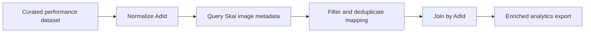

# Skai Image Enrichment Skill


A marketing analytics enrichment workflow that joins a trusted external performance dataset with creative image metadata from Skai. The goal is deliberately narrow: keep performance metrics in the source of truth, and use Skai only to enrich rows with image URLs and creative context.

## Why It Matters

Creative analysis often breaks because performance data and creative assets live in different systems. This skill creates a clean bridge: analysts can keep their curated metrics while adding the visual layer needed for creative review, CTR analysis, and stakeholder storytelling.

| Business value | Technical value |
| --- | --- |
| Faster creative performance reviews | API-based `AdId -> ImageUrl` mapping |
| Keeps metrics aligned with the trusted source | Enrichment-only design, no metric replacement |
| Better analyst handoff files | CSV and JSON outputs with match status |
| Handles messy IDs and reused creatives | Ad ID normalization and one-to-many image handling |

## What It Can Do

- Read a base performance dataset from CSV or JSON.
- Extract or normalize ad identifiers from common naming patterns.
- Query Skai for ad image metadata in a date range.
- Filter non-image or video creatives when needed.
- Join image metadata back onto the original dataset.
- Export enriched records, mapping tables, and run summaries.

## Enrichment Flow



## Repository Structure

```text
.
|-- SKILL.md
|-- agents/openai.yaml
|-- references/
|   |-- configuration.md
|   `-- field-config.example.json
`-- scripts/
    |-- fixtures/sample_report.json
    `-- skai_image_ctr_report.py
```

## Example Command

```bash
python3 scripts/skai_image_ctr_report.py \
  --input-dataset /tmp/base_performance.csv \
  --input-ad-id-column ad_id \
  --country US \
  --start-date 2025-04-01 \
  --end-date 2025-04-30 \
  --output-dir /tmp/skai-enriched
```

## Outputs

| Output | Purpose |
| --- | --- |
| `enriched_ad_records.csv/json` | Original dataset plus image metadata |
| `skai_image_mapping.csv/json` | Reusable `AdId -> ImageUrl` mapping |
| `summary.json` | Match rates, filters, and run diagnostics |

## Design Principles

- Never replace curated performance metrics with platform exports.
- Keep one output row per input row unless the analyst explicitly asks for aggregation.
- Make match status visible instead of silently dropping records.
- Support account-specific field mappings through configuration.
- Keep credential files outside the repository.

## Skills Demonstrated

`marketing analytics`  -  `API enrichment`  -  `data joining`  -  `Python ETL`  -  `CSV/JSON pipelines`  -  `creative performance analysis`  -  `data quality checks`

## Security

This is a sanitized showcase repository. It contains no Skai credentials, client IDs, refresh tokens, profile IDs, private image URLs, or proprietary performance exports.
